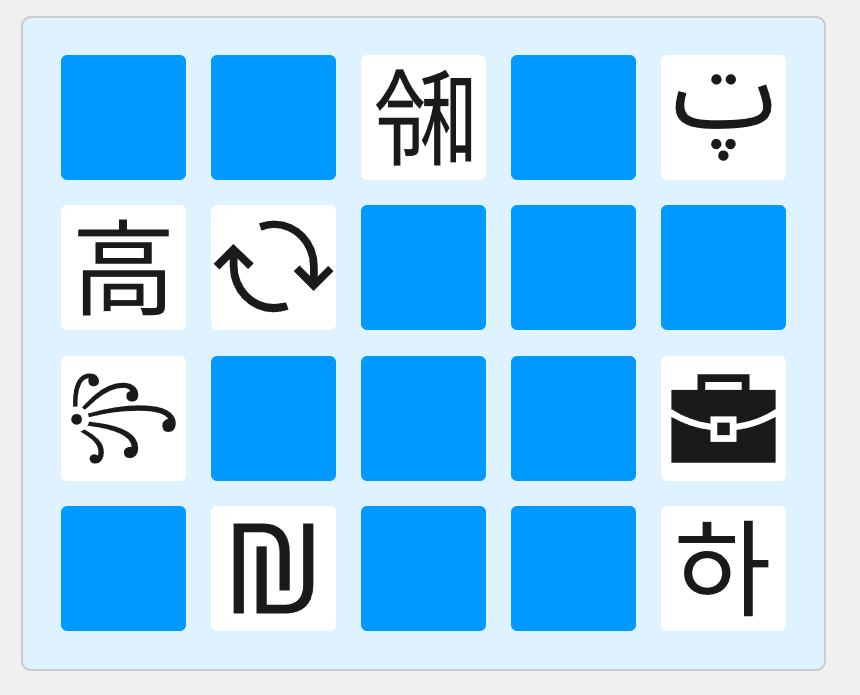

# トポロジー神経衰弱ゲーム

## 概要
トポロジー神経衰弱ゲームは、神経衰弱の要領でトポロジー同相な図形を見つけるゲームです。

## 遊び方
このゲームはHTML形式で作られており、以下のURLから直接遊ぶことができます：
[https://bolero-fk.github.io/TopologyMatching/](https://bolero-fk.github.io/TopologyMatching/)

### ルール説明
ゲームを開くと20枚のカードが裏向きに並べられています。
自由に2枚のカードを選択すると、選択されたカードが表向きになります。
選んだ2枚のカードがトポロジー同相な図形であれば、その2枚を取り除きます。
<ul>
トポロジー同相とは、形状がゴムのように伸縮自在であると想像したとき、一方の図形からもう一方の図形へ変形できるものを指します。
わかりやすい例は"穴"の数で各図形の穴の数によって同相かどうかを判定できます。
「〇」と「△」は穴の数が一つなのでトポロジー同相ですが、「〇」と「8」は穴の数が異なっているのでトポロジー同相ではありません。
また、穴の中に別の図形が存在する場合はそれぞれ独立して考えることができるので、「◎」と「〇〇」はトポロジー同相です。
</ul>
選んだカードがトポロジー同相でなかった場合、選んだ2枚のカードが再び裏に戻ります。
この手順を繰り返し、全てのカードを取り除くとクリアです。

## ファイル構造
以下に、このプロジェクトの主要なファイルとディレクトリについて説明します：

1. index.html : ゲームのメインページです。このHTMLファイルをブラウザで開くとゲームをプレイすることができます。
2. Scripts : ゲームの動作を制御するためのスクリプトが含まれているディレクトリです。
3. styles.css : ゲームのスタイルを定義しているCSSファイルです。
4. TopologyCards : トポロジーカードのデータが含まれているディレクトリです。
5. TopologyCardRegistrar : トポロジーカードの登録に関連するプログラムです。

## 使用されている素材について
神経衰弱ゲームに使用される画像は

1. [デジタル庁のイラストレーション・アイコン素材](https://www.digital.go.jp/policies/servicedesign/designsystem/Illustration_Icons/)
2. [Google Fonts Noto Sans](https://fonts.google.com/noto/fonts?query=Noto+Sans)をsvg画像に変換したもの

が使用されています。

それぞれの画像のライセンスについては
1. デジタル庁のイラストレーション・アイコン素材: [イラストレーション・アイコン素材利用規約](https://www.digital.go.jp/policies/servicedesign/designsystem/Illustration_Icons/terms_of_use/)
2. Google Fonts Noto Sans: [SIL Open Font License (OFL)](https://scripts.sil.org/cms/scripts/page.php?site_id=nrsi&id=OFL)

を参照してください。