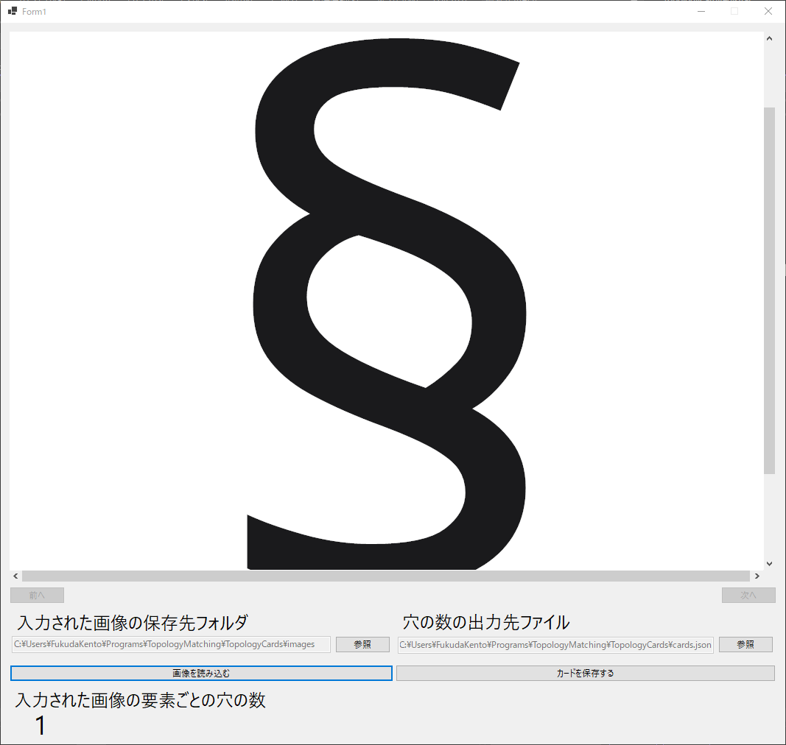

# トポロジーカード登録ソフト
このディレクトリにはトポロジー神経衰弱で使われるトポロジーカードの登録の支援を目的とするソフトウェアが入っています。
このソフトを使用すると画像の保存とその画像に関するjsonファイルの書き込みを行うことができます

## ファイル構造
```
TopologyCardRegister
│- TopologyCardRegister.sln
│
└───TopologyCardRegister
    │- MainForm.Designer.cs
    │- MainForm.cs
    │- MainForm.resx
    │- JsonSaver.cs
    │- Program.cs
    │- TopologyCalculator.cs
    │- TopologyCardRegister.csproj
```

## ファイル説明
TopologyCardRegister.sln: ソリューションファイル。Visual Studio で開きます。
TopologyCardRegister.csproj: プロジェクト設定ファイル。
MainForm.cs, MainForm.Designer.cs, MainForm.resx: メインフォームのソースコードと設定。
JsonSaver.cs: JSON 形式でデータを保存するためのクラスが定義されています。
Program.cs: アプリケーションのエントリーポイントです。メインフォームを起動します。
TopologyCalculator.cs: トポロジー計算のためのクラスが定義されています。

## ビルド方法
Visual Studioを使用してビルドしてください。ビルドはTopologyCardRegister.sln ファイルを開いてビルドタブからソリューションのビルドを押下すると実行できます。

## 使用方法
ビルドして生成された実行可能ファイル（.exe）を実行すると以下の画面が表示されます。

「入力された画像の保存先」には登録するカードの画像を保存するフォルダを指定してください
「穴の数の出力先ファイル」にはトポロジーカードの情報をまとめたjsonファイルを指定してください。既に存在するファイルを指定した場合は情報が追加される形で出力されます。
「画像を読み込む」ボタンを押下すると上画面に読み込んだ画像が表示されます。また、読み込んだ画像の穴の数が「入力された画像の要素ごとの穴の数」の部分に表示されます。
以上の3つのボタンを押すと「カードを保存する」ボタンが押せるようになります。
このボタンを押すと画像と図形の情報がjsonに保存されます。
